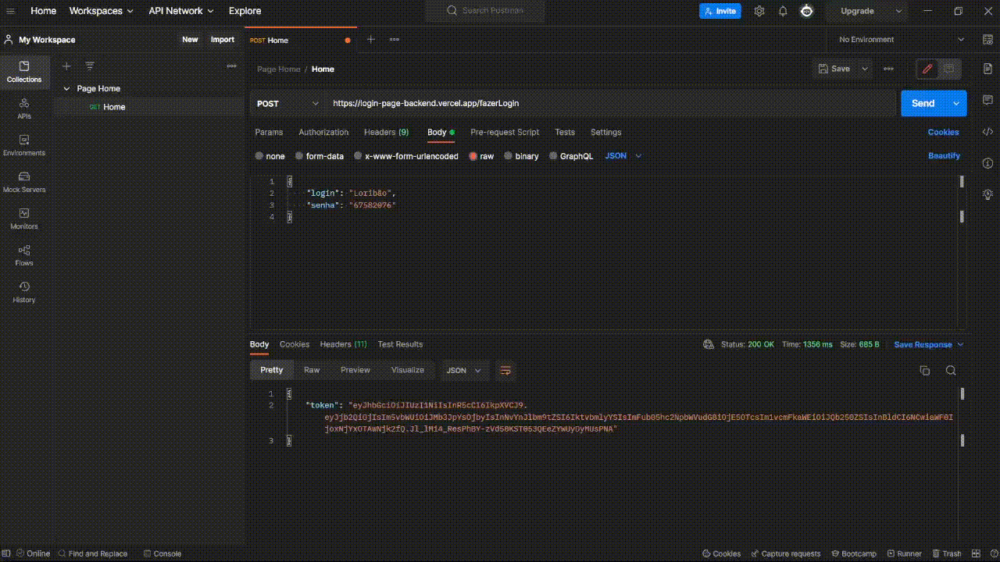
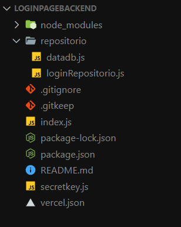
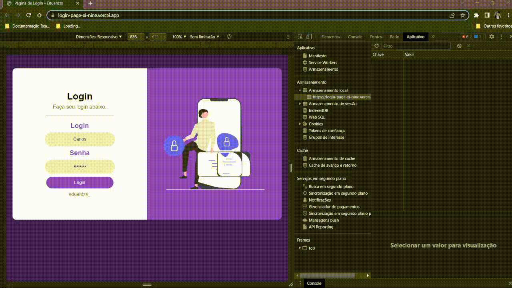

<h2>Backend Login Page</h2>

      

<a href="https://login-page-backend.vercel.app/" target=”_blank”>Link do Projeto</a>

Esse projeto foi feito visando a consolidação dos conhecimentos básicos em WebAPI com Express.

Para está construção foram usados alguns verbos HTTP - GET e POST.

Utilizando uma base MOCK para consulta de informações, e o JWT para geração de token.

Para a boilerplate foi utilizado o template básico do Express.

      

<a href="https://login-page-backend.vercel.app/" target=”_blank”>Link do Projeto</a>

    <h4>Designer do Frontend</h4>
    

